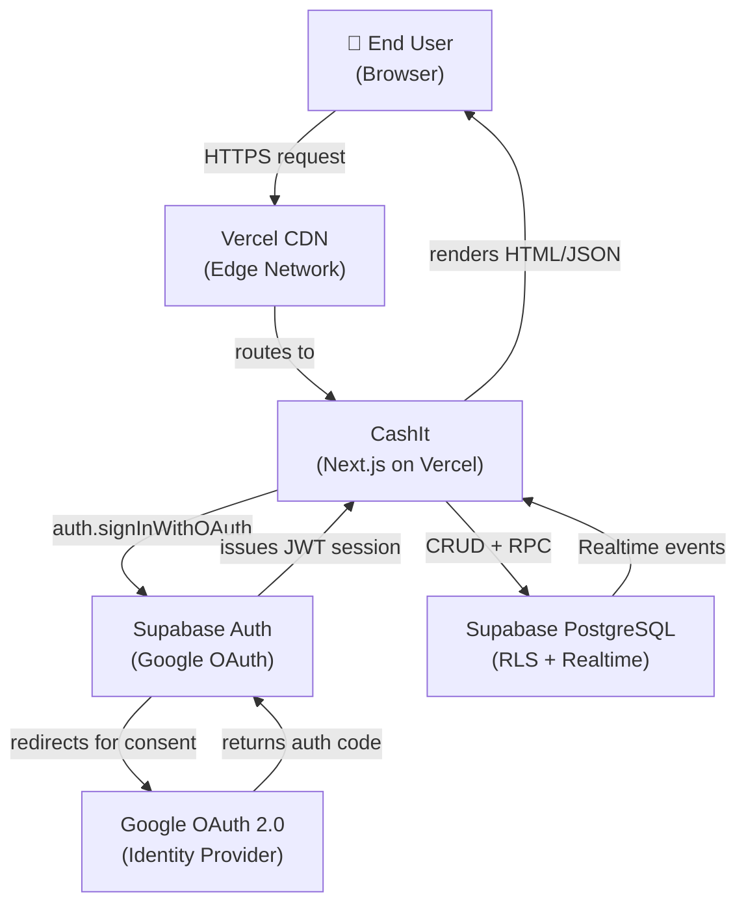
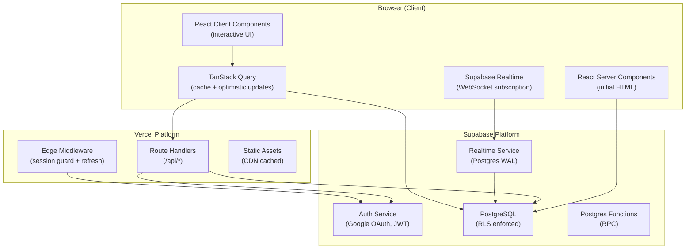

# Software Architecture Document (SAD)
## CashIt — Personal Expense Tracker Web Application

> **Document Control**

| Field | Details |
|---|---|
| **Version** | 1.0.0 |
| **Status** | Draft |
| **Author** | Lead Systems Engineer |
| **Date Created** | 2026-05-28 |
| **References** | `SRS.md` v1.0.0, `FSD.md` v1.0.0 |

---

## Table of Contents

1. [Architecture Overview](#1-architecture-overview)
2. [System Context Diagram](#2-system-context-diagram)
3. [High-Level Component Diagram](#3-high-level-component-diagram)
4. [Data Flow Diagrams](#4-data-flow-diagrams)
5. [Database Schema Design](#5-database-schema-design)
6. [Entity Relationship Diagram](#6-entity-relationship-diagram)
7. [Authentication Architecture](#7-authentication-architecture)
8. [Real-Time Architecture](#8-real-time-architecture)
9. [Next.js Application Structure](#9-nextjs-application-structure)
10. [Security Architecture](#10-security-architecture)
11. [Deployment Architecture](#11-deployment-architecture)
12. [Architectural Decision Records](#12-architectural-decision-records)

---

## 1. Architecture Overview

CashIt follows a **full-stack monolithic architecture** built on Next.js App Router. There is no separate backend API service — the Next.js application handles both UI rendering (React Server Components) and backend logic (Route Handlers). Supabase provides the managed PostgreSQL database, authentication, and real-time event streaming.

### 1.1 Architectural Principles

| Principle | Implementation |
|---|---|
| **Security at the data layer** | RLS on every table; no application-level trust |
| **Server-first rendering** | RSC for initial data; client hydration for interactivity |
| **Optimistic UI** | TanStack Query mutations with rollback on failure |
| **Real-time by default** | Supabase Realtime subscriptions drive UI sync |
| **Type safety end-to-end** | TypeScript strict + Zod runtime validation |
| **Zero floating-point money** | BIGINT storage for all monetary amounts |

### 1.2 Key Technology Decisions

| Concern | Choice | Reason |
|---|---|---|
| Framework | Next.js 14 App Router | RSC, edge middleware, Vercel-native |
| Auth | Supabase Auth + Google OAuth | Managed, secure cookie session via `@supabase/ssr` |
| Database | Supabase PostgreSQL | RLS, Realtime, RPC functions, managed |
| Client state | TanStack Query v5 | Optimistic updates, cache invalidation, server-seeding |
| Validation | Zod | Runtime schema enforcement matching DB constraints |
| Charts | Recharts | MIT license, React-native, responsive |
| Deployment | Vercel | Edge middleware, preview deployments, analytics |

---

## 2. System Context Diagram



---

## 3. High-Level Component Diagram



---

## 4. Data Flow Diagrams

### 4.1 Authentication Flow

```
1. User → clicks "Continue with Google" (browser)
2. Browser → supabase.auth.signInWithOAuth({ provider: 'google' })
3. Supabase Auth → generates PKCE verifier + state → redirects to Google
4. Google → presents consent screen
5. User → grants consent
6. Google → redirects to /auth/callback?code=AUTH_CODE&state=STATE
7. /auth/callback Route Handler → supabase.auth.exchangeCodeForSession(code)
8. Supabase Auth → validates code, issues JWT + refresh token
9. @supabase/ssr → writes session to HttpOnly cookie
10. Route Handler → 302 redirect to /dashboard
11. Middleware → reads cookie, validates session on every subsequent request
12. Postgres trigger → syncs user identity to public.users table
```

### 4.2 Transaction Write Flow (Optimistic)

```
1. User → submits Add Transaction form
2. Client → Zod validates payload (amount as integer, date ≤ today)
3. TanStack Query mutation → onMutate fires:
   a. Cancel in-flight queries for ['transactions', userId]
   b. Snapshot current cache
   c. Insert optimistic row into cache (temp ID)
   d. UI updates instantly (< 16ms)
4. supabase.from('transactions').insert(payload) → Supabase REST API
5. Supabase → RLS checks auth.uid() = payload.user_id
6. PostgreSQL → writes row, emits WAL event
7. Supabase Realtime → broadcasts to channel user-{userId}
8. useSupabaseRealtime hook → queryClient.invalidateQueries(...)
9. TanStack Query → re-fetches authoritative data from Supabase
10. UI re-renders with server-confirmed data (total < 500ms)

On step 4 failure:
→ onError: rollback cache to snapshot, toast.error(...)
```

### 4.3 Dashboard Load Flow (SSR + Hydration)

```
1. Browser → GET /dashboard (with session cookie)
2. Edge Middleware → validates session, refreshes JWT if needed
3. Next.js Server Component → parallel fetch:
   a. supabase.from('wallets').select(...)
   b. supabase.from('transactions').select(...).limit(10)
4. Server → renders HTML with embedded data
5. Browser → receives full HTML (LCP event fires)
6. React hydration → Client Components become interactive
7. TanStack Query → seeded with server data (no loading flash)
8. useSupabaseRealtime → WebSocket channel opened
9. Dashboard is live and reactive
```

---

## 5. Database Schema Design

### 5.1 Table: `users`

| Column | Type | Constraints | Description |
|---|---|---|---|
| `id` | `UUID` | PK, references `auth.users(id)` | Supabase Auth user ID |
| `email` | `TEXT` | NOT NULL, UNIQUE | Google account email |
| `full_name` | `TEXT` | | Google display name |
| `avatar_url` | `TEXT` | | Google profile photo URL |
| `created_at` | `TIMESTAMPTZ` | NOT NULL, DEFAULT `now()` | Record creation time |
| `updated_at` | `TIMESTAMPTZ` | NOT NULL, DEFAULT `now()` | Last update time |

**RLS Policies**:
```sql
-- SELECT: own row only
CREATE POLICY "users_select_own" ON users
  FOR SELECT USING (auth.uid() = id);

-- UPDATE: own row only
CREATE POLICY "users_update_own" ON users
  FOR UPDATE USING (auth.uid() = id);
```

---

### 5.2 Table: `wallets`

| Column | Type | Constraints | Description |
|---|---|---|---|
| `id` | `UUID` | PK, DEFAULT `gen_random_uuid()` | Wallet identifier |
| `user_id` | `UUID` | NOT NULL, FK → `users(id)` ON DELETE CASCADE | Owner |
| `name` | `TEXT` | NOT NULL, CHECK length 3–30 | Display name |
| `icon` | `TEXT` | NOT NULL, DEFAULT `'💵'` | Emoji icon |
| `created_at` | `TIMESTAMPTZ` | NOT NULL, DEFAULT `now()` | Creation time |
| `updated_at` | `TIMESTAMPTZ` | NOT NULL, DEFAULT `now()` | Last update time |

**Indexes**:
```sql
CREATE INDEX idx_wallets_user_id ON wallets(user_id);
```

**RLS Policies**:
```sql
CREATE POLICY "wallets_all_own" ON wallets
  FOR ALL USING (auth.uid() = user_id)
  WITH CHECK (auth.uid() = user_id);
```

---

### 5.3 Table: `categories`

| Column | Type | Constraints | Description |
|---|---|---|---|
| `id` | `UUID` | PK, DEFAULT `gen_random_uuid()` | Category ID |
| `name` | `TEXT` | NOT NULL, UNIQUE | Display name |
| `icon` | `TEXT` | NOT NULL | Emoji or icon key |
| `color` | `TEXT` | NOT NULL | Hex color for charts |
| `sort_order` | `INTEGER` | NOT NULL, DEFAULT `0` | Display ordering |

**Seed Data** (inserted via migration):

| name | icon | color |
|---|---|---|
| Food & Drink | 🍜 | `#76E8B6` |
| Transport | 🚗 | `#4B96F3` |
| Shopping | 🛍️ | `#A78BFA` |
| Entertainment | 🎮 | `#FB923C` |
| Health | 💊 | `#34D399` |
| Bills & Utilities | 💡 | `#F472B6` |
| Education | 📚 | `#60A5FA` |
| Personal Care | 🪒 | `#FCD34D` |
| Travel | ✈️ | `#F87171` |
| Other | 📦 | `#94A3B8` |

**RLS Policies**:
```sql
-- Public read for all authenticated users
CREATE POLICY "categories_select_authenticated" ON categories
  FOR SELECT USING (auth.role() = 'authenticated');
-- Write: service_role only (no user policy = blocked by default-deny)
```

---

### 5.4 Table: `transactions`

| Column | Type | Constraints | Description |
|---|---|---|---|
| `id` | `UUID` | PK, DEFAULT `gen_random_uuid()` | Transaction ID |
| `user_id` | `UUID` | NOT NULL, FK → `users(id)` ON DELETE CASCADE | Owner |
| `wallet_id` | `UUID` | NOT NULL, FK → `wallets(id)` ON DELETE RESTRICT | Assigned wallet |
| `type` | `TEXT` | NOT NULL, CHECK IN ('income','expense') | Transaction type |
| `amount` | `BIGINT` | NOT NULL, CHECK > 0 | Amount in whole IDR units |
| `category` | `TEXT` | NOT NULL, FK → `categories(name)` | Expense/income category |
| `note` | `TEXT` | CHECK length ≤ 120 | Optional user note |
| `date` | `DATE` | NOT NULL, CHECK ≤ CURRENT_DATE | Transaction date |
| `created_at` | `TIMESTAMPTZ` | NOT NULL, DEFAULT `now()` | Record creation time |
| `updated_at` | `TIMESTAMPTZ` | NOT NULL, DEFAULT `now()` | Last update time |

**Indexes**:
```sql
CREATE INDEX idx_txn_user_date    ON transactions(user_id, date DESC);
CREATE INDEX idx_txn_user_wallet  ON transactions(user_id, wallet_id, date DESC);
CREATE INDEX idx_txn_user_type    ON transactions(user_id, type, date DESC);
```

**RLS Policies**:
```sql
CREATE POLICY "transactions_all_own" ON transactions
  FOR ALL USING (auth.uid() = user_id)
  WITH CHECK (auth.uid() = user_id);
```

> **Note on `amount`**: Stored as `BIGINT`. For IDR (no decimal subdivision), 1 IDR = 1 unit. Display layer uses `Intl.NumberFormat('id-ID', { style: 'currency', currency: 'IDR' })`.

---

### 5.5 Postgres Functions (RPC)

#### `get_wallet_balances(p_user_id UUID)`
Returns computed balances per wallet (never computed client-side).

```sql
CREATE OR REPLACE FUNCTION get_wallet_balances(p_user_id UUID)
RETURNS TABLE(wallet_id UUID, balance BIGINT) AS $$
  SELECT
    wallet_id,
    SUM(CASE WHEN type = 'income' THEN amount ELSE -amount END) AS balance
  FROM transactions
  WHERE user_id = p_user_id
  GROUP BY wallet_id;
$$ LANGUAGE sql STABLE SECURITY DEFINER;
```

#### `get_category_breakdown(p_user_id UUID, p_from DATE, p_to DATE)`
Returns expense totals grouped by category for analytics charts.

```sql
CREATE OR REPLACE FUNCTION get_category_breakdown(
  p_user_id UUID, p_from DATE, p_to DATE
)
RETURNS TABLE(category TEXT, total BIGINT) AS $$
  SELECT category, SUM(amount) AS total
  FROM transactions
  WHERE user_id = p_user_id
    AND type = 'expense'
    AND date BETWEEN p_from AND p_to
  GROUP BY category
  ORDER BY total DESC;
$$ LANGUAGE sql STABLE SECURITY DEFINER;
```

#### `get_period_summary(p_user_id UUID, p_from DATE, p_to DATE)`
Returns total income and expense for dashboard summary cards.

```sql
CREATE OR REPLACE FUNCTION get_period_summary(
  p_user_id UUID, p_from DATE, p_to DATE
)
RETURNS TABLE(total_income BIGINT, total_expense BIGINT) AS $$
  SELECT
    SUM(CASE WHEN type = 'income' THEN amount ELSE 0 END) AS total_income,
    SUM(CASE WHEN type = 'expense' THEN amount ELSE 0 END) AS total_expense
  FROM transactions
  WHERE user_id = p_user_id AND date BETWEEN p_from AND p_to;
$$ LANGUAGE sql STABLE SECURITY DEFINER;
```

---

## 6. Entity Relationship Diagram

```
┌─────────────────────┐       ┌──────────────────────────┐
│       users         │       │         wallets           │
├─────────────────────┤       ├──────────────────────────┤
│ id          UUID PK │◄──┐   │ id          UUID PK      │
│ email       TEXT    │   │   │ user_id     UUID FK──────►│ users.id
│ full_name   TEXT    │   │   │ name        TEXT          │
│ avatar_url  TEXT    │   │   │ icon        TEXT          │
│ created_at  TSTZ    │   │   │ created_at  TSTZ          │
│ updated_at  TSTZ    │   │   │ updated_at  TSTZ          │
└─────────────────────┘   │   └──────────────────────────┘
                          │              │
                          │              │ 1
                          │              ▼ N
                          │   ┌──────────────────────────┐
                          │   │      transactions        │
                          │   ├──────────────────────────┤
                          └───│ user_id     UUID FK      │
                              │ id          UUID PK      │
                              │ wallet_id   UUID FK──────► wallets.id
                              │ type        TEXT          │
                              │ amount      BIGINT        │
                              │ category    TEXT FK──────►│ categories.name
                              │ note        TEXT          │
                              │ date        DATE          │
                              │ created_at  TSTZ          │
                              │ updated_at  TSTZ          │
                              └──────────────────────────┘

┌─────────────────────┐
│      categories     │
├─────────────────────┤
│ id          UUID PK │
│ name        TEXT UK │◄── transactions.category
│ icon        TEXT    │
│ color       TEXT    │
│ sort_order  INT     │
└─────────────────────┘
```

**Cardinality Summary**:

| Relationship | Type |
|---|---|
| `users` → `wallets` | One-to-Many (1 user : N wallets) |
| `users` → `transactions` | One-to-Many (1 user : N transactions) |
| `wallets` → `transactions` | One-to-Many (1 wallet : N transactions) |
| `categories` → `transactions` | One-to-Many (1 category : N transactions) |

---

## 7. Authentication Architecture

### 7.1 Session Lifecycle

```
Sign In:
  Browser → supabase.auth.signInWithOAuth (PKCE flow)
  Google → auth code
  /auth/callback → exchangeCodeForSession
  @supabase/ssr → writes 3 HttpOnly cookies:
    - sb-access-token  (JWT, 1hr expiry)
    - sb-refresh-token (opaque, 7d expiry)
    - sb-auth-token    (metadata)

Per-Request:
  Edge Middleware → reads cookies via @supabase/ssr
  → supabase.auth.getUser() (validates JWT with Supabase)
  → if expired: supabase.auth.refreshSession() (silent refresh)
  → updated cookies written to response
  → request forwarded to route handler / page

Sign Out:
  Client → supabase.auth.signOut()
  Supabase → invalidates refresh token server-side
  @supabase/ssr → clears all auth cookies
  → redirect to /
```

### 7.2 Cookie Security Properties

| Cookie | HttpOnly | Secure | SameSite | Max-Age |
|---|---|---|---|---|
| `sb-access-token` | ✅ | ✅ | Lax | 3600s |
| `sb-refresh-token` | ✅ | ✅ | Lax | 604800s |

---

## 8. Real-Time Architecture

### 8.1 Supabase Realtime Configuration

Realtime is enabled on `transactions` and `wallets` tables via the Supabase Dashboard (or migration):

```sql
-- Enable realtime on tables
ALTER PUBLICATION supabase_realtime ADD TABLE transactions;
ALTER PUBLICATION supabase_realtime ADD TABLE wallets;
```

### 8.2 Channel Design

Each authenticated user subscribes to a **single, user-scoped channel** named `user-{userId}`. This channel listens for all `INSERT`, `UPDATE`, and `DELETE` events on both `transactions` and `wallets` rows where `user_id = userId`.

**Why one channel per user**: Prevents cross-user broadcast, minimises WebSocket connections, simplifies cleanup on unmount.

### 8.3 Realtime + TanStack Query Integration

Supabase Realtime events do **not** directly mutate the UI state. They trigger `queryClient.invalidateQueries(...)` which causes TanStack Query to re-fetch the latest data from Supabase. This pattern ensures:
- **Authoritative data**: UI always shows server-confirmed state.
- **Optimistic-then-confirm**: User sees optimistic update instantly, then server data replaces it seamlessly.
- **Multi-tab sync**: If the user has multiple tabs open, Realtime events keep all tabs in sync.

---

## 9. Next.js Application Structure

```
c:\CashIt\cashit\
├── app/
│   ├── layout.tsx                  # Root layout (fonts, providers, toaster)
│   ├── page.tsx                    # Landing / Login (SSG, public)
│   ├── auth/
│   │   └── callback/route.ts       # OAuth callback Route Handler
│   ├── dashboard/
│   │   ├── layout.tsx              # Dashboard shell (nav, sidebar)
│   │   ├── page.tsx                # Dashboard RSC (parallel data fetch)
│   │   ├── wallets/page.tsx        # Wallet management page
│   │   ├── analytics/page.tsx      # Analytics page
│   │   └── profile/page.tsx        # Profile & settings
│   └── api/
│       ├── auth/callback/route.ts  # (alias; handled above)
│       ├── wallets/route.ts        # GET, POST /api/wallets
│       ├── wallets/[id]/route.ts   # PATCH, DELETE /api/wallets/:id
│       ├── transactions/route.ts   # GET, POST /api/transactions
│       ├── transactions/[id]/route.ts
│       ├── analytics/route.ts      # GET /api/analytics
│       └── user/delete/route.ts    # DELETE /api/user/delete
├── components/
│   ├── ui/                         # Primitives: Button, Input, Modal, Toast
│   ├── dashboard/
│   │   ├── DashboardClient.tsx
│   │   ├── TotalBalanceCard.tsx
│   │   ├── PeriodSummaryCards.tsx
│   │   ├── WalletRow.tsx
│   │   └── RecentTransactionsList.tsx
│   ├── transactions/
│   │   ├── TransactionModal.tsx
│   │   ├── TransactionRow.tsx
│   │   └── CategoryPicker.tsx
│   ├── wallets/
│   │   ├── WalletCard.tsx
│   │   └── WalletModal.tsx
│   └── analytics/
│       ├── DonutChart.tsx
│       └── PeriodFilter.tsx
├── hooks/
│   ├── useSupabaseRealtime.ts
│   ├── useWallets.ts
│   ├── useTransactions.ts
│   └── useAnalytics.ts
├── lib/
│   ├── supabase/
│   │   ├── client.ts               # createBrowserClient()
│   │   └── server.ts               # createServerClient()
│   ├── schemas/
│   │   ├── transaction.ts          # Zod schemas
│   │   └── wallet.ts
│   ├── formatters.ts               # formatIDR(), formatDate()
│   └── constants.ts                # CATEGORY_COLORS, PERIODS
├── types/
│   └── database.ts                 # Supabase generated types
├── middleware.ts                   # Edge session guard
├── supabase/
│   └── migrations/
│       ├── 001_create_users.sql
│       ├── 002_create_wallets.sql
│       ├── 003_create_categories.sql
│       ├── 004_create_transactions.sql
│       ├── 005_rls_policies.sql
│       ├── 006_rpc_functions.sql
│       └── 007_realtime_enable.sql
└── public/
    └── icons/                      # Static SVG/PNG assets
```

---

## 10. Security Architecture

### 10.1 Defence-in-Depth Layers

```
Layer 1 — Transport:    Vercel enforces HTTPS/TLS 1.2+, HSTS
Layer 2 — Edge:         Next.js Middleware validates session on every request
Layer 3 — Application:  Zod validates all inputs before any DB operation
Layer 4 — Database:     Supabase RLS default-deny; per-table access policies
Layer 5 — Auth:         HttpOnly cookies; no localStorage; PKCE OAuth flow
```

### 10.2 Threat Model Summary

| Threat | Mitigation |
|---|---|
| XSS token theft | HttpOnly cookies; no auth tokens in JS-accessible storage |
| CSRF on OAuth | `state` parameter validated in `/auth/callback` |
| SQL injection | Supabase parameterized client; no raw SQL in app code |
| Cross-user data access | RLS `auth.uid() = user_id` on every table |
| Privilege escalation | `service_role` key never sent to browser |
| Mass assignment | Explicit column selection in all Supabase queries |
| Overfetching PII | Google OAuth scopes: `openid email profile` only |

---

## 11. Deployment Architecture

### 11.1 Environments

| Environment | Branch | URL Pattern | Supabase Project |
|---|---|---|---|
| Production | `main` | `cashit.app` | `cashit-prod` |
| Preview | PR branches | `cashit-git-*.vercel.app` | `cashit-staging` |
| Local | N/A | `localhost:3000` | Supabase local (`supabase start`) |

### 11.2 Vercel Architecture

```
Browser Request
  → Vercel Edge Network (CDN)
    → Static assets served directly from CDN (HTML shell, JS bundles, fonts)
    → Dynamic requests routed to:
        Edge Middleware (session validation — Edge Runtime)
          → Server Components (Node.js Serverless)
          → Route Handlers (Node.js Serverless)
            → Supabase (ap-southeast-1, Singapore)
```

### 11.3 Environment Variables

| Variable | Scope | Description |
|---|---|---|
| `NEXT_PUBLIC_SUPABASE_URL` | Client + Server | Supabase project REST URL |
| `NEXT_PUBLIC_SUPABASE_ANON_KEY` | Client + Server | Public anon key (RLS enforced) |
| `SUPABASE_SERVICE_ROLE_KEY` | Server only | Admin key for account deletion |

> `SUPABASE_SERVICE_ROLE_KEY` must **never** be prefixed with `NEXT_PUBLIC_` and must **never** be referenced in Client Components.

### 11.4 CI/CD Pipeline

```
Developer pushes PR
  → GitHub Actions:
      1. pnpm install
      2. eslint --max-warnings 0
      3. tsc --noEmit
      4. vitest run
  → All checks pass?
      YES → Vercel creates preview deployment (auto)
      NO  → PR blocked from merge

PR merged to main
  → Vercel production deployment (auto)
  → Supabase migrations applied manually via:
      supabase db push --project-ref <prod-ref>
```

---

## 12. Architectural Decision Records

### ADR-001 — Next.js App Router over Pages Router

**Status**: Accepted  
**Decision**: Use Next.js App Router (RSC model).  
**Rationale**: Server Components eliminate unnecessary client JS for data-only pages; Layouts enable persistent dashboard shell without re-mounting; Edge Middleware integrates natively with Vercel deployment model.  
**Trade-off**: Steeper learning curve; some ecosystem libraries not yet RSC-compatible.

---

### ADR-002 — Supabase over Firebase

**Status**: Accepted  
**Decision**: Use Supabase (PostgreSQL) over Firebase (Firestore).  
**Rationale**: Relational schema enforces referential integrity between wallets and transactions; SQL aggregation functions eliminate client-side data processing; RLS provides declarative, testable security; Realtime built on Postgres WAL is more reliable than Firestore's snapshot listeners for financial data.  
**Trade-off**: Supabase free tier has connection limits; requires SQL knowledge for migrations.

---

### ADR-003 — BIGINT for Monetary Amounts

**Status**: Accepted  
**Decision**: Store all `amount` fields as `BIGINT` (whole IDR units).  
**Rationale**: IEEE 754 double-precision floating-point cannot represent many decimal fractions exactly. Accumulated rounding errors in financial totals are unacceptable. IDR has no decimal subdivision, making integer storage a natural fit.  
**Trade-off**: Requires consistent integer/display conversion discipline in the application layer.

---

### ADR-004 — TanStack Query over React Context / Zustand

**Status**: Accepted  
**Decision**: TanStack Query v5 is the sole client-side server-state manager.  
**Rationale**: Built-in optimistic update API with automatic rollback; cache invalidation by query key; server-data seeding via `initialData`; stale-while-revalidate semantics align with the real-time update model.  
**Trade-off**: Adds ~13KB gzipped to client bundle; requires discipline in query key design.

---

### ADR-005 — Single Realtime Channel per User

**Status**: Accepted  
**Decision**: Each authenticated client opens one Supabase Realtime channel named `user-{userId}` covering both `transactions` and `wallets` tables.  
**Rationale**: Fewer WebSocket connections per client; simpler cleanup logic; natural scoping prevents cross-user event leakage. Realtime events trigger cache invalidation rather than direct state mutation, keeping TanStack Query as the single source of truth.  
**Trade-off**: All table changes for a user flow through one channel; filtering logic runs in the handler.

---

*End of SAD v1.0.0 — CashIt*
